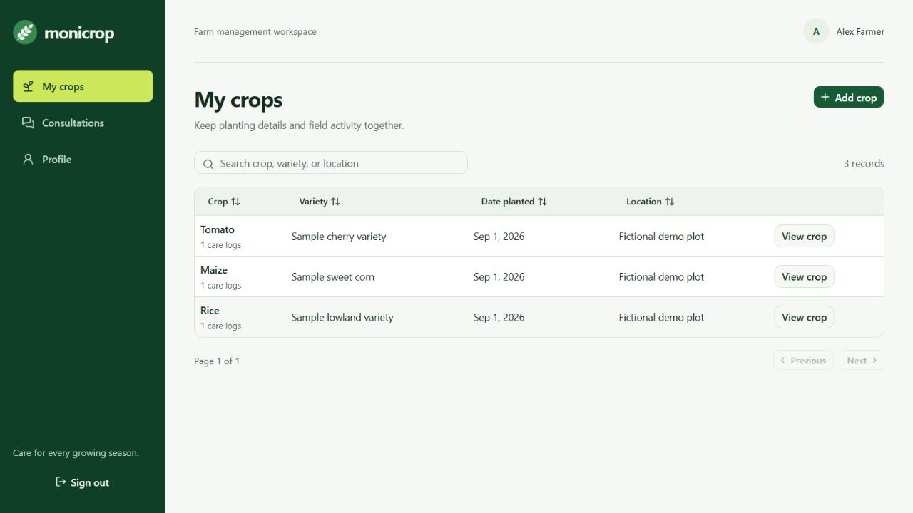

# Monicrop

Monicrop now runs on **Next.js 16, React 19, Tailwind CSS 4, Base UI/shadcn primitives, TanStack Table 8, and XAMPP MySQL/MariaDB**. Next.js Route Handlers provide the backend; Node.js serves the application.

## Local demo from GitHub

This repository publishes the Next.js application with a clean schema and fictional demo data. Private database exports, photos, credentials, and the local PHP rollback files are excluded from Git. The demo is editable and runs locally; GitHub stores the source code, not a hosted application.



Install **Node.js 24**, Git, and XAMPP, then start **MySQL** in XAMPP. After cloning this repository, run:

```powershell
cd monicrop
npm ci
Copy-Item .env.demo.example .env.demo.local # Initial setup only.
npm run demo:setup
npm run demo:dev
```

Open **http://127.0.0.1:3001**. Use any account below with the public demo password **`Demo-only-2026!`**:

| Role          | Fictional email           | Explore                                  |
| ------------- | ------------------------- | ---------------------------------------- |
| Farmer        | `farmer@example.test`     | Crops, care logs, consultations, profile |
| Consultant    | `consultant@example.test` | Conversation inbox, replies, credentials |
| Administrator | `admin@example.test`      | Account management                       |

Demo setup creates `monicrop_demo`, containing three fictional accounts, three crops, three care logs, and two messages. It refuses the regular `monicrop` database or remote DB/app destinations. Running setup again preserves demo edits; it never deletes records or resets passwords. If a database named `monicrop_demo` already contains records without the demo seed marker, seeding stops for manual review. Use the public demo password only for fictional accounts. Keep this editable demo on loopback; public hosting needs a separate deployment design.

For production-build verification locally:

```powershell
npm run demo:build
npm run demo:start
```

While the demo is running, `npm run demo:test` checks real HTTP/MySQL workflows using temporary records and removes its own fixtures afterward. Use one app instance per browser profile if switching between the regular app and demo, because cookies are shared across localhost ports.

## Regular application setup

Start **MySQL** in XAMPP. Use **Node.js 24** for the application and verification scripts (verified with Node 24.20).

```powershell
cd monicrop
npm ci
Copy-Item .env.example .env.local # Only on initial setup; preserve an existing .env.local.
npm run db:setup
npm run dev
```

Open **http://127.0.0.1:3000**. Configure `.env.local` for your own database. Keep `APP_ORIGIN` equal to the URL you use; cross-origin writes are rejected. The Node server binds to the loopback address. On the original development computer, the existing `.env.local` continues to use the original `monicrop` database.

For a production build locally:

```powershell
npm run build
npm start
```

Apache is needed only for phpMyAdmin or the PHP rollback retained on the original computer. A GitHub clone does not include those rollback files. On the original computer, open the PHP version at `http://localhost/monicrop/legacy/`.

## Existing data and accounts

- Setup is additive and repeatable. Existing rows, IDs, MySQL credentials, and image folders are preserved. On an empty database, setup imports definitions from `database/schema.sql`, which contains no personal records.
- Existing accounts can use their current email and password. First successful login records a scrypt hash in `monicrop_auth` without modifying the legacy password row. Sessions are stored as hashed, revocable tokens in `monicrop_sessions`.
- New registrations always create farmer (`client`) accounts. Only administrators can create consultant/admin accounts. New credentials and password changes are supported by Next.js; they do not update the plaintext legacy password field. Password changes revoke existing sessions.
- Consultants publish their expertise from **Profile → Consultant credentials**. Their `cons_ID` is resolved separately from their login `user_ID`.
- JPEG, PNG, and WebP uploads are limited to 5 MB, decoded and converted to WebP, and served through authorized API routes. Legacy photos live in `legacy/profile/` and `legacy/pics/`; their stored database paths remain unchanged and resolve through the protected media API. Uploaded files are retained after record deletion; routine retention/garbage collection is not part of this migration.

For a new, empty database, register a farmer account first, then bootstrap its administrator role using the local command below. It only runs when no administrator exists:

```powershell
npm run db:bootstrap-admin -- your-email@example.com
```

## Workflows

Farmers can create/edit/delete crops, maintain every care-log field, upload crop photos, message consultants, and update profiles. Consultants can read/reply to their conversations and maintain credentials. Administrators can create/edit/delete accounts. Search, sortable columns, and pagination use TanStack Table, with responsive navigation and keyboard-accessible Base UI controls.

## Project layout

- `src/app/`: Next.js routes, layouts, API handlers, and Tailwind styling
- `src/components/`: migrated screens and generated Base UI/shadcn primitives
- `src/lib/`: DB pool, sessions, authorization, validation, and feature services
- `scripts/`: additive database setup and temporary-data verification
- `tests/`: password, origin, date, and role boundary checks
- `database/schema.sql`: public table definitions, without data rows
- `.env.demo.example`: safe template for the isolated local demo
- `legacy/`: local-only PHP rollback, styles/assets, original photos, and `database/monicrop.sql`; the entire folder is ignored by Git
- `uploads/` and `test-results/`: local-only images/artifacts, ignored by Git

## Preparing a public repository

```powershell
git init -b main # Only if Git is not initialized yet.
npm run repo:check
git status --short
```

`repo:check` inspects both tracked files and untracked files eligible for adding. It rejects private/generated paths, SQL data rows, common provider credential patterns, private keys, registry credentials, and common personal email domains, without printing credential values. This is a targeted guard, not a guarantee that every secret or private detail can be detected. Review the exact staged diff with `git diff --cached` before committing, then run the guard again.

Only source/configuration, the lockfile, the clean schema, fictional demo setup, and reviewed public assets should be committed. Keep `.env.local` and `.env.demo.local` private; commit the example templates. Never force-add the original dump or photo folders. Ignore rules do not remove files already tracked or previously published. See [SECURITY.md](SECURITY.md).

## Verification

```powershell
npm run typecheck
npm run lint
npm test
npm run test:integration # Keep the app running; uses temporary accounts and records.
npm run build
```

Integration checks use the database in `.env.local`, create clearly named temporary fixtures, exercise actual HTTP/API persistence and access restrictions, then remove their own records. Existing records are not edited. `--keep` retains fixtures for a browser pass; `node --env-file=.env.local scripts/cleanup-fixtures.mjs` removes those retained fixtures after verification.

TanStack Table is deliberately pinned to v8 to match its documented `useReactTable` API. React Compiler is disabled; lint reports its advisory about v8's mutable table API, with no lint errors. The remaining npm high-severity advisory is the unpatched `braces` dependency used by Next's ESLint plugin to parse developer-supplied glob patterns. It does not run in request handling; do not lint untrusted repositories. No forced framework downgrade was applied. Review this tooling advisory by 2026-10-17.

The generated dialog/select motion is preserved. Proposed tuning is in [MOTION-REVIEW.md](MOTION-REVIEW.md); its separate polish pass requires confirmation under the requested transitions skill.

See [MIGRATION.md](MIGRATION.md) for the data/rollback contract. Original PHP remains available for rollback and retains its original security limitations; retire legacy access separately after cutover.

Official references: [Next.js installation](https://nextjs.org/docs/app/getting-started/installation), [shadcn Base UI components](https://ui.shadcn.com/docs/components/base/button), [TanStack Table v8](https://tanstack.com/table/v8/docs/api/core/table).
